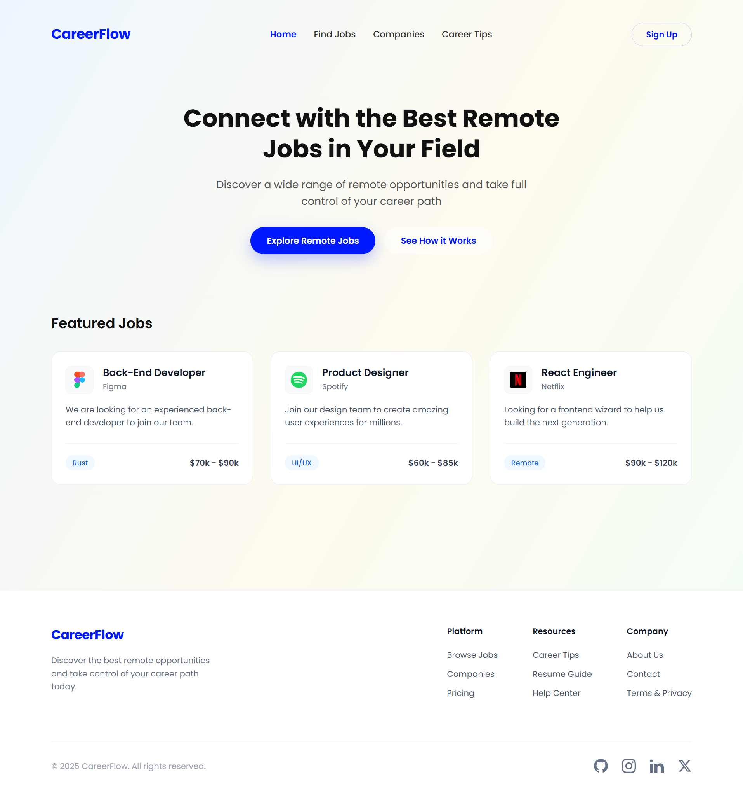

# CareerFlow 🚀

A modern, responsive multi-page platform for finding Jobs, Internships, and Career Advice. Designed with a focus on clean UI, glassmorphism aesthetics, and maintainable code architecture.


## 📸 Preview



> *The Full UI Design of CareerFlow Platform*

## ✨ Features

### 🎨 UI/UX Design
* **Glassmorphism & Gradients:** Utilizes a fixed, subtle linear gradient background with glass-like containers for a modern feel.
* **Responsive Layout:** Fully adaptive design using CSS Grid & Flexbox for Desktop, Tablet, and Mobile screens.
* **Consistent Theming:** Unified color palette, typography (Poppins), and component styling across all pages.
* **Interactive Elements:** Smooth hover effects on cards, buttons, and navigation items.

### ⚙️ Functionality
* **Multi-Page Navigation:** Seamless navigation between Home, Find Jobs, Companies, and Career Tips pages.
* **Search & Filtering:** Interactive search bars and category filter tags (powered by vanilla JS).
* **Modular Architecture:** CSS is refactored into scalable modules (`base`, `layout`, `components`, `pages`) for easy maintenance.
* **Newsletter Section:** A modernized subscription box with clean UI and focus states.

## 🛠️ Tech Stack

* **HTML5:** Semantic markup structure.
* **CSS3:** modular architecture with Variables, Flexbox, Grid, and Media Queries.
* **JavaScript (ES6):** DOM manipulation for mobile menu and filter interactions.
* **Fonts:** Google Fonts (Poppins).
* **Icons:** Inline SVG (No external heavy libraries).

## 📂 Project Structure

The project uses a **Modular CSS Architecture** to ensure scalability and maintainability.

```bash
CareerFlow/
├── assets/                  # Images and logos
│   └── preview.png          # Screenshot for README
├── css/
│   ├── base.css             # Reset, Variables, Typography
│   ├── components.css       # Buttons, Cards, Inputs, Search Bar
│   ├── layout.css           # Navbar, Footer, Container, Media Queries
│   ├── pages.css            # Hero, Specific Page Grids
│   └── style.css            # Main entry point (Imports all modules)
├── javascript/
│   └── script.js            # Logic for Navbar & Filters
├── index.html               # Landing Page
├── jobs.html                # Job Search Page
├── companies.html           # Company Directory Page
├── tips.html                # Career Blog Page
└── README.md                # Documentation
```

## 🚀 How to Run

Since this is a static website, you don't need to install any dependencies.

1. Clone the repository:

```
git clone [https://github.com/ridhocrnv/CareerFlow.git](https://github.com/ridhocrnv/CareerFlow.git)
```
2. Navigate to the project folder:
```
cd CareerFlow
```
3. Open index.html in your favorite browser.

## 🎨 Color Palette

| Color | Hex | Description |
| :--- | :--- | :--- |
|  | `#001aff` | **Primary Brand Color** (Buttons, Active States, Hover) |
|  | `#101828` | **Slate 900** (Headings, Main Text) |
|  | `#344054` | **Slate 700** (Secondary Text) |
|  | `#667085` | **Slate 500** (Descriptions, Footer Text) |
|  | `#eff8ff` | **Light Blue** (Tag Backgrounds) |
|  | `#ffffff` | **White** (Cards, Navbar Background) |

## 🤝 Contributing

Contributions are what make the open source community such an amazing place to learn, inspire, and create. Any contributions you make are **greatly appreciated**.

1.  **Fork the Project** (Click the 'Fork' button at the top right of this page)
2.  **Create your Feature Branch** (`git checkout -b feature/AmazingFeature`)
3.  **Commit your Changes** (`git commit -m 'feat: Add some AmazingFeature'`)
4.  **Push to the Branch** (`git push origin feature/AmazingFeature`)
5.  **Open a Pull Request**

## 👤 Author

**Ridho Ahmad Irawan**

* **GitHub:** [@ridhocrnv](https://github.com/ridhocrnv)
* **Project Link:** [https://github.com/ridhocrnv/CareerFlow](https://github.com/ridhocrnv/CareerFlow)